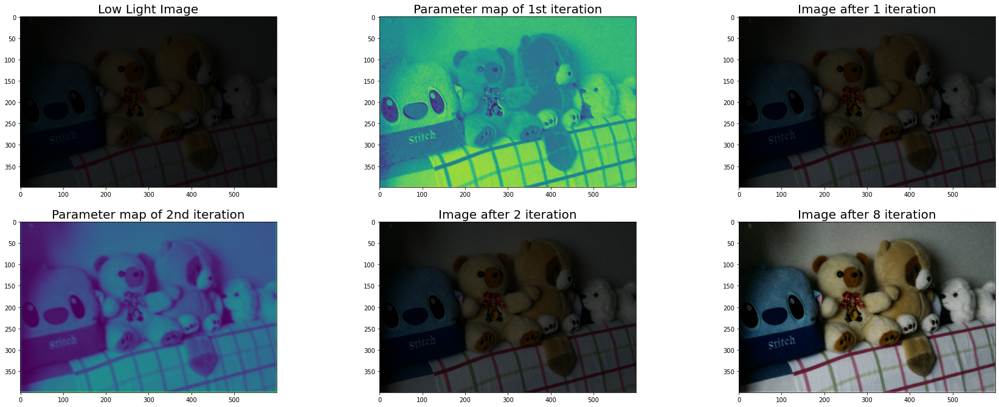
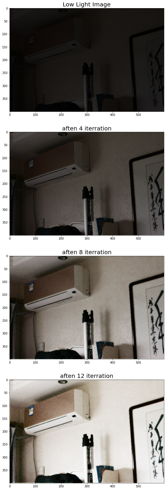
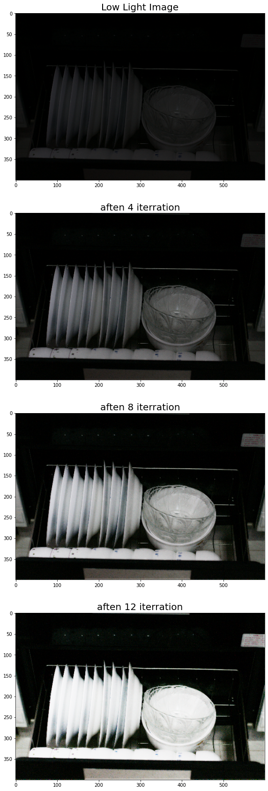
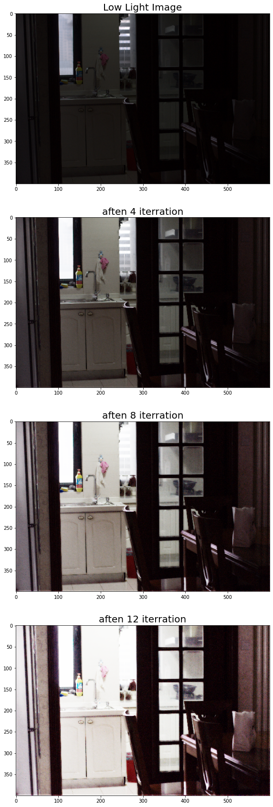
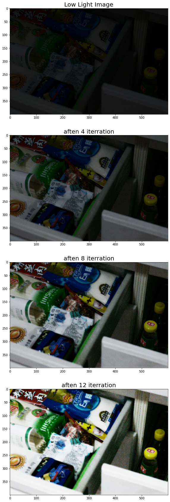
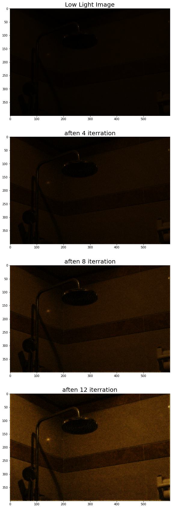

# **Processors Team**
### Computer Vision Competition 2020
### Faculty of Engineering - ASU

<br/>

---

<br/>

# **Low Light Image Enhancement Project**

<br/>

---
Images captured in outdoor scenes can be highly degraded due to poor lighting conditions. These images can have low dynamic ranges with high noise levels that affect the overall performance of computer vision algorithms. To make computer vision algorithms robust in low-light conditions, use low-light image enhancement to improve the visibility of an image.<br/><br/>
In this notebook we are doing low light image enhancement through multi Deep neural network layers, which extracts a parameter map with the same size as the given image. then apply this equation on the original image and extracted map.<br/>


> **E** = **I** + **M** **I** ( 1 - **I** )<br/>

**E**: enhanced image<br/>
**I**: low light image<br/>
**M**: parameter map<br/>
<br/>

we do this algorith for ***n***  number of iterations, 
this is the general rule:


> **E**new = **E**old + **M**new **E**old ( 1 - **E**old)<br/>

**E**new: the output enhanced image<br/>
**E**old: the enhanced image from the previous iteration<br/>
**M**new: the parameter map of this iteration<br/>

<br/>


---

<br/>

### **First**, we connect to the drive.


---


```
from google.colab import drive
drive.mount('/content/gdrive')
```

    Drive already mounted at /content/gdrive; to attempt to forcibly remount, call drive.mount("/content/gdrive", force_remount=True).
    

### **Importing** required libraries.


---


```
import numpy as np
import cv2
import imageio
import glob
import matplotlib.pyplot as plt
from scipy import ndimage
from tensorflow.keras.models import load_model
```

### **Loading** The trained neural network model.


---


```
Model = load_model(r'/content/gdrive/My Drive/ImageProcessing/ourModel.h5')
```

### **Loading** some low light images.


---


```
path = r'/content/gdrive/My Drive/LOLdataset/our485/low'
all_files = glob.glob(path + "/*.png")
all_files.sort()
low = list()
for fileName in all_files:       
        img = imageio.imread(fileName)
        low.append(img)
        
low = np.array(low)

```

### **Here**, we applied the steps we mentioned above.


---


```
plt.figure(figsize=(30,30))

plt.subplot(5,3,1)
plt.title("Low Light Image",fontsize=20)
plt.imshow(low[0])   #displaying the original image

h, w, c = low[0].shape    #height, width, channels

plt.subplot(5,3,2)
plt.title("Parameter map of 1st iteration",fontsize=20)

test = Model.predict(low[0].reshape(1, h, w, 3))    #getting the 1st parameter map with pixel values ranged [0:1] float 
temp = low[0] / 255    #making the orignal image to be in range [0:1], this step done only at the first iteration

plt.imshow(test[0,:,:,0])   #displaying parameter map of 1st iteration

plt.subplot(5,3,3)
plt.title("Image after 1 iteration",fontsize=20)
image1 = temp + ((test[0,:,:,:] * temp)*(1-temp))  #applying our general equation
plt.imshow(image1)   #display the enhanced image after 1 iteration

plt.subplot(5,3,4)
plt.title("Parameter map of 2nd iteration",fontsize=20)

test2 = Model.predict(image1.reshape(1, h, w, 3))  #getting the 2nd parameter map with pixel values ranged [0:1] float 
plt.imshow(test2[0,:,:,0])   #displaying parameter map of 2nd iteration

plt.subplot(5,3,5)
plt.title("Image after 2 iteration",fontsize=20)
image2 = image1 + ((test2[0,:,:,:] * image1)*(1-image1))   #applying our general equation
plt.imshow(image2)   #display the enhanced image after 2 iteration

#applying the same steps over and over until the 8th iteration

test3 = Model.predict(image2.reshape(1, h, w, 3))
image3 = image2 + ((test3[0,:,:,:] * image2)*(1-image2))

test4 = Model.predict(image3.reshape(1, 400, 600, 3))
image4 = image3 + ((test4[0,:,:,:] * image3)*(1-image3))

test5 = Model.predict(image4.reshape(1, h, w, 3))
image5 = image4 + ((test5[0,:,:,:] * image4)*(1-image4))

test6 = Model.predict(image5.reshape(1, h, w, 3))
image6 = image5 + ((test6[0,:,:,:] * image5)*(1-image5))

test7 = Model.predict(image6.reshape(1, h, w, 3))
image7 = image6 + ((test7[0,:,:,:] * image6)*(1-image6))

test8 = Model.predict(image7.reshape(1, h, w, 3))
image8 = image7 + ((test8[0,:,:,:] * image7)*(1-image7))


plt.subplot(5,3,6)
plt.title("Image after 8 iteration",fontsize=20)
plt.imshow(image8)   #the Final enhanced image after 8 iteration

```


    <matplotlib.image.AxesImage at 0x7f0aec40b4e0>





### we converted this steps of iterations into recursive function. <br/>
**inputs:** <br/>
img: the low light image (**I**, **E**old) <br/>
index: no of iterations <br/>
flag: default = 1 


---


```
def Enhance(img, index, flag):
    if index == 0:
      return img

    elif flag == 1:
        h, w, c = img.shape
        test = Model.predict(img.reshape(1, h, w, 3))
        temp = img / 255
        image = temp + ((test[0,:,:,:] * temp)*(1-temp))
        index = index - 1
        flag = 0
        return Enhance(image, index, flag)

    else:
        h, w, c = img.shape
        temp = Model.predict(img.reshape(1, h, w, 3))
        image = img + ((temp[0,:,:,:] * img)*(1-img))
        index = index - 1
        return Enhance(image, index, flag)
```

# Some Examples


---


```
IMAGE = low[30]
plt.figure(figsize=(30,30))

plt.subplot(4,1,1)
plt.title("Low Light Image",fontsize=20)
plt.imshow(IMAGE)

plt.subplot(4,1,2)
plt.title("aften 4 iterration",fontsize=20)
image4 = Enhance(IMAGE, 4, 1)
plt.imshow(image4)

plt.subplot(4,1,3)
plt.title("aften 8 iterration",fontsize=20)
image8 = Enhance(IMAGE, 8, 1)
plt.imshow(image8)

plt.subplot(4,1,4)
plt.title("aften 12 iterration",fontsize=20)
image12 = Enhance(IMAGE, 12, 1)
plt.imshow(image12)
```


    <matplotlib.image.AxesImage at 0x7f0aea5107f0>





```
IMAGE = low[1]
plt.figure(figsize=(30,30))

plt.subplot(4,1,1)
plt.title("Low Light Image",fontsize=20)
plt.imshow(IMAGE)

plt.subplot(4,1,2)
plt.title("aften 4 iterration",fontsize=20)
image4 = Enhance(IMAGE, 4, 1)
plt.imshow(image4)

plt.subplot(4,1,3)
plt.title("aften 8 iterration",fontsize=20)
image8 = Enhance(IMAGE, 8, 1)
plt.imshow(image8)

plt.subplot(4,1,4)
plt.title("aften 12 iterration",fontsize=20)
image12 = Enhance(IMAGE, 12, 1)
plt.imshow(image12)
```


    <matplotlib.image.AxesImage at 0x7f0aea2ca828>





```
IMAGE = low[2]
plt.figure(figsize=(30,30))

plt.subplot(4,1,1)
plt.title("Low Light Image",fontsize=20)
plt.imshow(IMAGE)

plt.subplot(4,1,2)
plt.title("aften 4 iterration",fontsize=20)
image4 = Enhance(IMAGE, 4, 1)
plt.imshow(image4)

plt.subplot(4,1,3)
plt.title("aften 8 iterration",fontsize=20)
image8 = Enhance(IMAGE, 8, 1)
plt.imshow(image8)

plt.subplot(4,1,4)
plt.title("aften 12 iterration",fontsize=20)
image12 = Enhance(IMAGE, 12, 1)
plt.imshow(image12)
```


    <matplotlib.image.AxesImage at 0x7f0aea1be0f0>





```
IMAGE = low[476]
plt.figure(figsize=(30,30))

plt.subplot(4,1,1)
plt.title("Low Light Image",fontsize=20)
plt.imshow(IMAGE)

plt.subplot(4,1,2)
plt.title("aften 4 iterration",fontsize=20)
image4 = Enhance(IMAGE, 4, 1)
plt.imshow(image4)

plt.subplot(4,1,3)
plt.title("aften 8 iterration",fontsize=20)
image8 = Enhance(IMAGE, 8, 1)
plt.imshow(image8)

plt.subplot(4,1,4)
plt.title("aften 12 iterration",fontsize=20)
image12 = Enhance(IMAGE, 12, 1)
plt.imshow(image12)
```


    <matplotlib.image.AxesImage at 0x7f0ae9f91be0>





```
IMAGE = low[100]
plt.figure(figsize=(30,30))

plt.subplot(4,1,1)
plt.title("Low Light Image",fontsize=20)
plt.imshow(IMAGE)

plt.subplot(4,1,2)
plt.title("aften 4 iterration",fontsize=20)
image4 = Enhance(IMAGE, 4, 1)
plt.imshow(image4)

plt.subplot(4,1,3)
plt.title("aften 8 iterration",fontsize=20)
image8 = Enhance(IMAGE, 8, 1)
plt.imshow(image8)

plt.subplot(4,1,4)
plt.title("aften 12 iterration",fontsize=20)
image12 = Enhance(IMAGE, 12, 1)
plt.imshow(image12)
```


    <matplotlib.image.AxesImage at 0x7f0aea2b8d30>




